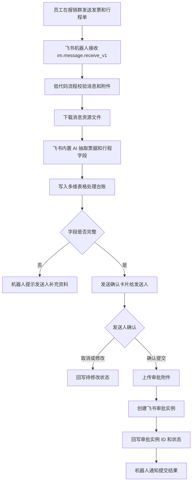

# 架构说明

## 目标

把报销入口统一放在飞书内，让公司成员无需安装脚本或打开本机服务即可使用。员工只需要在指定群里发送发票和行程单，机器人负责整理、确认和提交审批。

## 系统边界

- 飞书自建应用：机器人身份、消息事件订阅、消息回复、审批 API 调用权限。
- 飞书低代码平台/集成平台：流程编排、条件分支、字段映射、错误处理。
- 多维表格：处理台账、去重、异常补录、运营统计。
- 飞书审批：最终报销审批实例。
- 自定义连接器：仅在低代码原生动作不足时补齐飞书 OpenAPI 调用。

## 主流程

## 关键设计决策

- 必须有确认环节：发票和行程单识别存在误差，不能静默提交财务审批。
- 多维表格是事实台账：所有状态、错误和人工补录都落表，方便财务追踪。
- `uuid` 必须稳定：审批创建使用幂等 key，避免重复消息造成重复审批。
- 生产不依赖本地 CLI：`lark-cli` 只用于开发验证，正式运行在飞书低代码/集成平台。

## 状态流转

| 状态 | 说明 |
| --- | --- |
| `received` | 已接收群消息，尚未下载附件 |
| `files_downloaded` | 附件已下载或已获得可处理文件引用 |
| `extracted` | AI 已输出结构化字段 |
| `need_more_info` | 缺少必要资料或字段置信度不足 |
| `pending_confirm` | 等待发送人确认 |
| `confirmed` | 发送人已确认提交 |
| `submitted` | 飞书审批实例已创建 |
| `failed` | 流程失败，需要管理员处理 |
| `duplicate` | 判定为重复发票或重复消息 |
